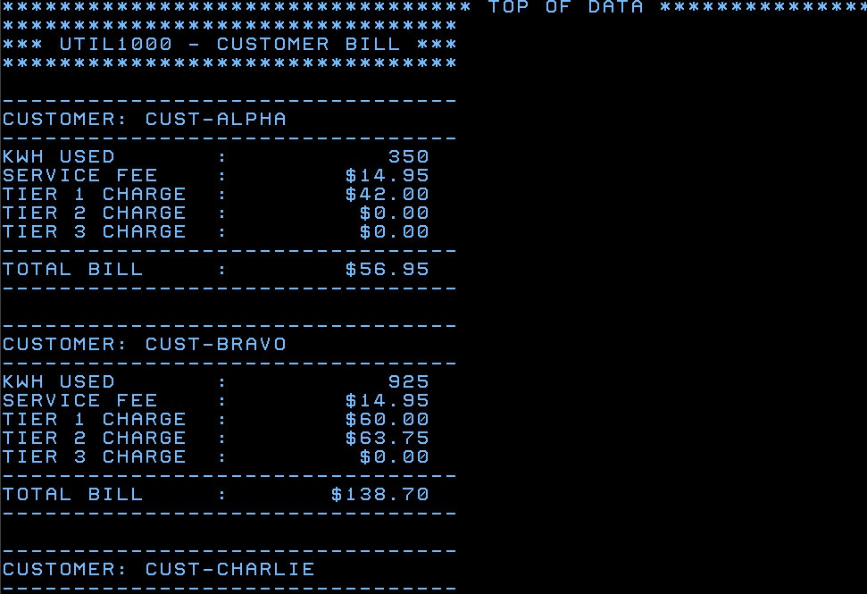
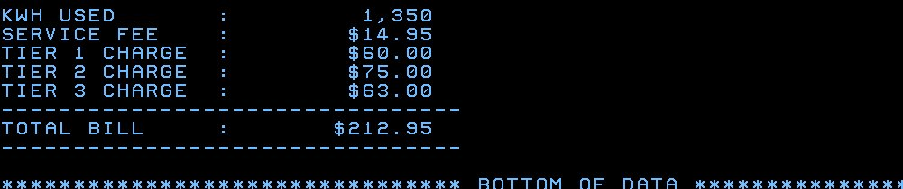
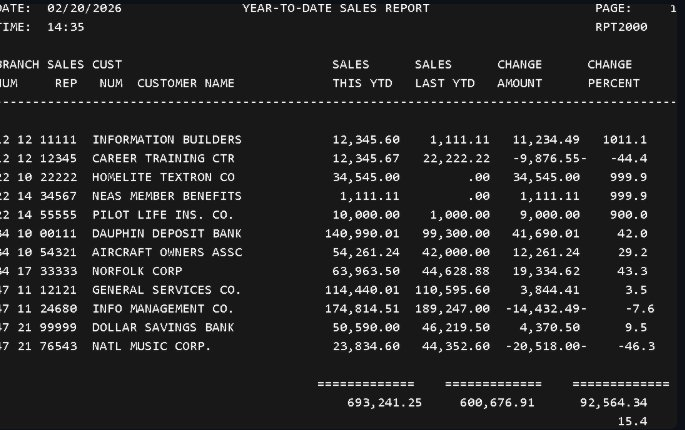
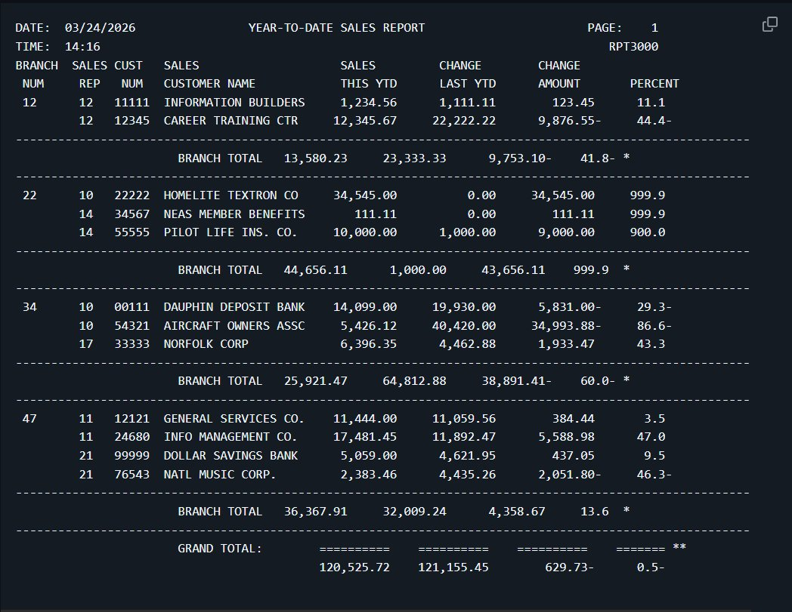
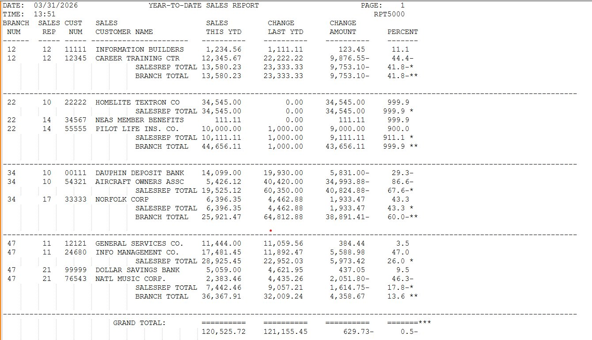
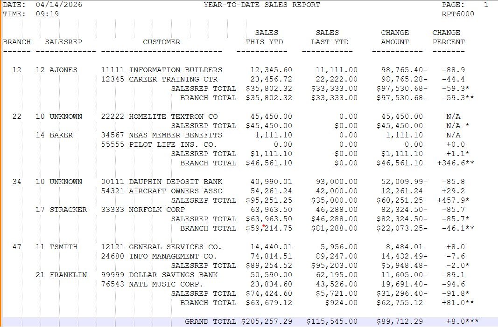
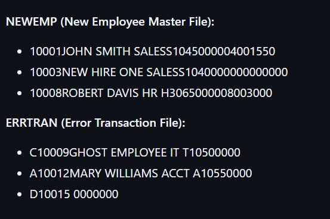

# :computer: Grant Peverett - Gateway Portfolio

Welcome to my gateway portfolio. This repository is a central hub linking to all of my COBOL/JCL projects completed during **CIS352 - Introduction to Enterprise Computing** at Wayne State College. Each project was developed on the IBM z/OS mainframe using TSO/ISPF and compiled with the IGYWCLG procedure.

---

## :bookmark_tabs: Table of Contents

| # | Repository | Primary Tech | Category | Author(s) |
|:-:|:-----------|:-------------|:---------|:----------|
| 1 | [UTIL2000](#util2000) | COBOL / JCL | Utility Billing Program | Grant Peverett |
| 2 | [CALC2000](#calc2000) | COBOL / JCL | Investment Future Value Calculator | Grant Peverett, Garret Finke |
| 3 | [RPT2000](#rpt2000) | COBOL / JCL | Sales Report Program | Grant Peverett, Hayden Schmidt |
| 4 | [RPT3000](#rpt3000) | COBOL / JCL | YTD Sales Report (Branch Totals) | Grant Peverett, Kayley Wells |
| 5 | [RPT5000](#rpt5000) | COBOL / JCL | YTD Sales Report (Control Break) | Grant Peverett |
| 6 | [RPT6000](#rpt6000) | COBOL / JCL / Copybooks | YTD Sales Report (COPY/Table) | Grant Peverett, Kayley Wells |
| 7 | [SEQ3000](#seq3000) | COBOL / JCL | Sequential File Maintenance | Grant Peverett |

---

## UTIL2000

**CIS352 - Introduction to Enterprise Computing**

> A COBOL utility billing program that calculates service fees for three customers. The program computes three tiers of charges based on kilowatt-hour consumption levels, displays KWH usage, and produces a total billing amount for each customer.

| Detail | Info |
|:-------|:-----|
| **Tech Stack** | COBOL, JCL, TSO/ISPF |
| **Key Concepts** | Tiered rate calculation, DISPLAY output formatting, COMPUTE statements, conditional logic for rate brackets |
| **Status** | :white_check_mark: Completed |
| **Type** | Course Project |

:link: [View Repository](https://github.com/Grantyy1/COBOL-UTIL2000)

[Back to Table of Contents](#bookmark_tabs-table-of-contents)

---

## CALC2000

**CIS352 - Introduction to Enterprise Computing**

> A COBOL program that calculates the future value of an investment using a fixed annual interest rate over a fixed number of years. After the first calculation, it doubles the investment amount twice, recalculating the future value each time for a total of three future-value results.

| Detail | Info |
|:-------|:-----|
| **Tech Stack** | COBOL, JCL, TSO/ISPF |
| **Key Concepts** | Future value calculation, COMPUTE statements, procedure-driven paragraphs, working-storage data items, DISPLAY output formatting, iterative doubling logic |
| **Status** | :white_check_mark: Completed |
| **Type** | Course Project (Collaborative) |
| **Collaborator** | [Garret Finke (gafink01)](https://github.com/gafink01) |

:link: [View Repository](https://github.com/gafink01/Cobol-CALC2000)

[Back to Table of Contents](#bookmark_tabs-table-of-contents)

---

## RPT2000

**CIS352 - Introduction to Enterprise Computing**

> A COBOL report program that calculates the change in each customer's sales from the previous year compared to the current year. It computes both the dollar amount difference and the percentage change, then outputs a formatted report showing branch number, sales rep, customer details, and both sales figures alongside the calculated changes.

| Detail | Info |
|:-------|:-----|
| **Tech Stack** | COBOL, JCL, TSO/ISPF |
| **Key Concepts** | Report generation, COMPUTE with percentage calculations, formatted print lines, working-storage data items, MOVE and COMPUTE operations |
| **Status** | :white_check_mark: Completed |
| **Type** | Course Project (Collaborative) |
| **Collaborator** | [Hayden Schmidt (Haschm05)](https://github.com/Haschm05) |

:link: [View Repository](https://github.com/Haschm05/COBOL_RPT2000)

[Back to Table of Contents](#bookmark_tabs-table-of-contents)

---

## RPT3000

**CIS352 - Introduction to Enterprise Computing**

> A COBOL report program that calculates the year-over-year change in each customer's sales and the corresponding percentage change. It outputs a formatted Year-To-Date Sales Report showing branch number, sales rep, customer number, customer name, current and previous year sales, the dollar change, and the percentage change. The report includes **branch subtotals** and a **grand total** line summarizing all branches.

| Detail | Info |
|:-------|:-----|
| **Tech Stack** | COBOL, JCL, TSO/ISPF |
| **Key Concepts** | Report generation with branch subtotals and grand totals, COMPUTE with percentage calculations, formatted print lines, working-storage data items, header/detail/summary line printing |
| **Status** | :white_check_mark: Completed |
| **Type** | Course Project (Collaborative) |
| **Collaborator** | [Kayley Wells (kayley-wells)](https://github.com/kayley-wells) |

:link: [View Repository](https://github.com/kayley-wells/RPT3000)

[Back to Table of Contents](#bookmark_tabs-table-of-contents)

---

## RPT5000

**CIS352 - Introduction to Enterprise Computing**

> A COBOL program that generates a Year-To-Date Sales Report comparing each customer's current-year sales against the previous year. It calculates the dollar change and percentage change, then uses a **two-level control break** structure to produce subtotals at the sales representative level and branch level, plus a grand total across all branches. The report includes formatted headings with the current date, time, and page numbers.

| Detail | Info |
|:-------|:-----|
| **Tech Stack** | COBOL, JCL, TSO/ISPF |
| **Key Concepts** | Two-level control break processing, accumulators for subtotals/grand totals, COMPUTE with ROUNDED and ON SIZE ERROR, 88-level condition names, page overflow handling, formatted report headings with date/time |
| **Status** | :white_check_mark: Completed |
| **Type** | Course Project |

:link: [View Repository](https://github.com/Grantyy1/COBOL_RPT5000)

[Back to Table of Contents](#bookmark_tabs-table-of-contents)

---

## RPT6000

**CIS352 - Introduction to Enterprise Computing**

> An advanced version of the YTD Sales Report that builds on RPT5000 by incorporating **COPY members (copybooks)** and **table handling** with OCCURS and SEARCH. The program reads customer master records and sales rep data from separate copybook-defined layouts, performs lookups, and generates the same control-break report structure with subtotals and grand totals. Developed collaboratively with Kayley Wells.

| Detail | Info |
|:-------|:-----|
| **Tech Stack** | COBOL, JCL, TSO/ISPF, Copybooks |
| **Key Concepts** | COPY members, REDEFINES, OCCURS/SEARCH for table lookups, copybook-driven record layouts, control break processing, IGYWCLG compile procedure |
| **Status** | :white_check_mark: Completed |
| **Type** | Course Project (Collaborative) |
| **Collaborator** | [Kayley Wells (kayley-wells)](https://github.com/kayley-wells) |

:link: [View Repository](https://github.com/Grantyy1/RPT6000)

[Back to Table of Contents](#bookmark_tabs-table-of-contents)

---

## SEQ3000

**CIS352 - Introduction to Enterprise Computing**

> A COBOL sequential file maintenance program that processes an Old Employee Master file alongside a Personnel Transaction file using the **balanced-line algorithm**. It handles three HR actions: Add (hire), Delete (terminate), and Change (update fields). Valid transactions produce an updated New Employee Master file, while invalid transactions are written to an Error Transaction file with full file status checking.

| Detail | Info |
|:-------|:-----|
| **Tech Stack** | COBOL, JCL, TSO/ISPF |
| **Key Concepts** | Balanced-line algorithm, sequential file maintenance (Add/Delete/Change), FILE STATUS checking, HIGH-VALUE end-of-file sentinels, 88-level condition names, graceful error termination, READ INTO / WRITE FROM idioms |
| **Status** | :white_check_mark: Completed |
| **Type** | Course Project |

:link: [View Repository](https://github.com/Grantyy1/SEQ3000)

[Back to Table of Contents](#bookmark_tabs-table-of-contents)

---

## About Me

**Grant Peverett**  
Wayne State College, Wayne, NE  
CIS352 - Introduction to Enterprise Computing  

<!--
**Grantyy1/Grantyy1** is a ✨ _special_ ✨ repository because its `README.md` (this file) appears on your GitHub profile.

Here are some ideas to get you started:

- 🔭 I’m currently working on ...
- 🌱 I’m currently learning ...
- 👯 I’m looking to collaborate on ...
- 🤔 I’m looking for help with ...
- 💬 Ask me about ...
- 📫 How to reach me: ...
- 😄 Pronouns: ...
- ⚡ Fun fact: ...
-->
